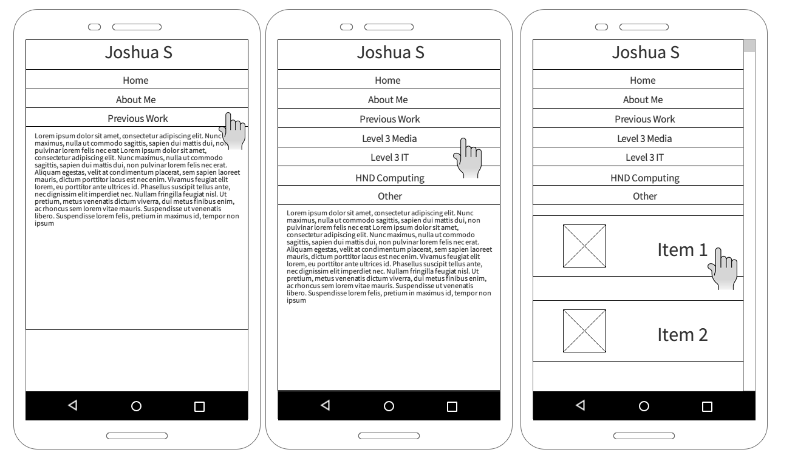
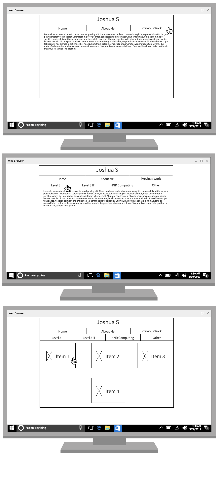

Joshua S (P17205320) Portfolio
=======

Single page app using HTML5, CSS3 & Native Javascript
Created for De Montfort University - Front-End-Web module

Design
======
 - Designed as a single page app as this was an area i had yet to explore
 - Uses java XMLHTTPREQUEST to request txt files which are then inserted into the page as html
 - Mobile-First design was also new territory for me
 - Uses flex-box to arrange items on screen
 - Simple, box like design used because its easy to adept to multiple screen sizes

Design Changes
==============

 Originally used tables to layout items but was changed to flexbox later on. The Change to flexbox was much more flexible as many items could be added and layout would be dealt with automatically while with the table the amount items has to be hard coded in. This change led to the design of the photography page
 
 Originally had content for pages in the javascript itself, for example
 

        -      pageLoadContent.innerHTML = "<article>\n" +		 +      loadContent("Pages/none.txt");
     -        "<h1>NONE</h1>\n" +		
     -        "<video controls>\n" +		
     -        "  <source src=\"https://portfolio.joshua-s.website/Media/Level_3_Interactive_Media/Video/None.webm\">\n" +		
     -        "</video>\n" +		
     -        "\n" +		
     -        "<ul>\n" +		
     -        "  <li>Called \"None\" because i had no idea what to call it</li>\n" +		
     -        "  <li>\"Animated\" in a single day</li>\n" +		
     -        "  <li>Originally was much longer but cut down to final act due to time (Full Script <a href = \"https://portfolio.joshua-s.website/Media/Level_3_Interactive_Media/Docs/None_Script.pdf\"> Here</a>)</li>\n" +		
     -        "  <li>Inspired by <a href = \"http://store.steampowered.com/app/57300/Amnesia_The_Dark_Descent/\">Amnesia: The Dark Descent</a></li>\n" +		
     -        "  <li>Well, <i>heavily</i> inspired. Sound effects, music and monster design all <del>Ripped Off</del> used for inspiration</li>\n" +		
     -        "  <figure>\n" +		
     -        "    \n" +		
     -        "    <figcaption>Spitting Image i'd say</figcaption>\n" +		
     -        "  </figure>\n" +		
     -        "</ul>\n" +		
     -        "</article>";
This meant that editing the page was a pain and the javascript became quite bloated. With the introduction of XMLHTTPREQUEST this code was slimmed down to this

    //Function Call
    loadContent("Pages/none.txt");
          
          function loadContent(e) {
            var xhttp = new XMLHttpRequest();
            xhttp.onreadystatechange = function() {
              if (this.readyState == 4 && this.status == 200) {
                pageLoadContent.innerHTML = this.responseText;
            };
            xhttp.open("GET", e, true);
            xhttp.send();
          }
This makes adding new pages and modifying old pages much simpler

Dropped Design Ideas
==========
 - Real time updating age counter on about me page
 - Slideshow/slider function on the photography page

Design Issues
==========
 - The website requires javascript to function so if a user doesn't want to use javascript ir can not use javascript then the website will not work
 - The website uses mutation events which are deprecated for mutation observers. Mutation events could be dropped in browsers at any point and break the website
 

Design Wireframe
==========
## Mobile

## Desktop

References
==========

https://codepen.io/thetallweeks/pen/boinE 

https://www.sitepoint.com/jquery-vs-raw-javascript-2-css3-animation/

https://www.w3schools.com/xml/xml_http.asp

https://www.sitepoint.com/five-techniques-lazy-load-images-website-performance/

https://icons8.com/preloaders/en/filtered-search/all/free

http://lea.verou.me/css3patterns/#carbon-fibre

